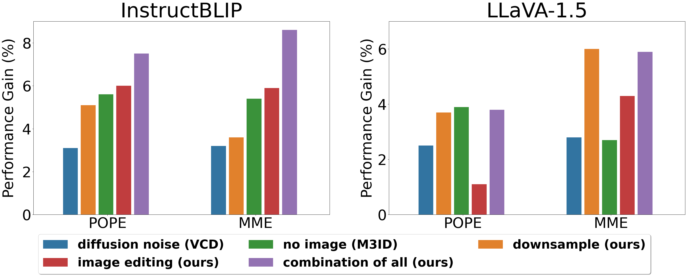

# Delve into Visual Contrastive Decoding for Hallucination Mitigation of Large Vision-Language Models
Official PyTorch implementaton of paper "[Delve into Visual Contrastive Decoding for Hallucination Mitigation of Large Vision-Language Models](https://arxiv.org/abs/2412.06775)".  
You can visit our project website [here](https://yilunlee.github.io/VCD_Analysis/).

## Introduction
While large vision-language models (LVLMs) have shown impressive capabilities in generating plausible responses correlated with input visual contents, they still suffer from hallucinations, where the generated text inaccurately reflects visual contents. To address this, recent approaches apply contrastive decoding to calibrate the model's response via contrasting output distributions with original and visually distorted samples, demonstrating promising hallucination mitigation in a training-free manner. However, the potential of changing information in visual inputs is not well-explored, so a deeper investigation into the behaviors of visual contrastive decoding is of great interest. In this paper, we first explore various methods for contrastive decoding to change visual contents, including image downsampling and editing. Downsampling images reduces the detailed textual information while editing yields new contents in images, providing new aspects as visual contrastive samples. To further study benefits by using different contrastive samples, we analyze probability-level metrics, including entropy and distribution distance. Interestingly, the effect of these samples in mitigating hallucinations varies a lot across LVLMs and benchmarks. Based on our analysis, we propose a simple yet effective method to combine contrastive samples, offering a practical solution for applying contrastive decoding across various scenarios. Extensive experiments are conducted to validate the proposed fusion method among different benchmarks.

<div align="center">
  
</div>

## Visually Changed Samples for Contrastive Decoding
<div align="center">
  
</div>


## Usage
To Do
### Enviroment
To Do
#### Prerequisites
To Do
#### Other requirements
```
To Do
```

### Prepare Dataset
To Do


### Evaluation
```
To Do 
```

### Train
To Do

```
To Do

```

## Acknowledgements
This code is based on [VCD](https://github.com/DAMO-NLP-SG/VCD).

## Citation
If you find this work useful for your research, please cite:
```Bibtex
@article{lee2024delvevisualcontrastivedecoding,
  title={Delve into Visual Contrastive Decoding for Hallucination Mitigation of Large Vision-Language Models},
  author={Yi-Lun Lee and Yi-Hsuan Tsai and Wei-Chen Chiu},
  journal={arXiv preprint arXiv:2412.06775},
  year={2024}
}
```
<!-- ```Bibtex
@inproceedings{lee2021bmvc,
 title = {Learning to Hide Residual for Boosting Image Compression},
 author = {Yi-Lun Lee and Yen-Chung Chen and Min-Yuan Tseng and Yi-Hsuan Tsai and Wei-Chen Chiu},
 booktitle = {British Machine Vision Conference (BMVC)},
 year = {2021}
}
``` -->

